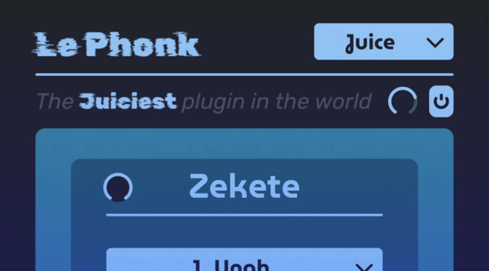

# Le Phonk

Le Phonk is the only plugin you will ever need.

Checkout the [product page](https://www.xynth.audio/plugins/lephonk) and [manual](https://www.xynth.audio/docs/plugins/lephonk).

## Building

### Option 1: Jucer
This option is now deprecated, as I have moved the project over to CMake. As a result the jucer project may or may not be up to date.

### Option 2: CMake

- Visual Studio: Run `cmake -B Builds`
- XCode: Run `cmake -B Builds -G Xcode`
- CLion: Simply open the project in CLion

## License

MIT